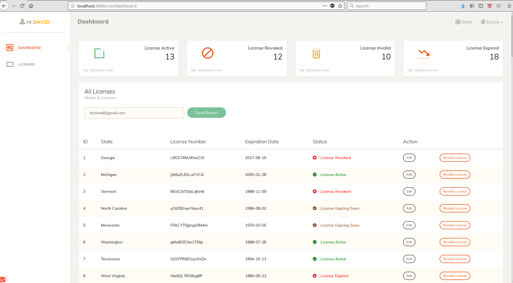

## License Tracker

Basic app to track license and send daily notice.

## Screenshots

## Features 
- dashboard
- license listing
- revoke license
- license update
- report sending.
- daily notice on expiry licenses

## Setup
- clone repo
- follow Laravel setup instructons
- set db parameters in .env file
- run `php artisan migrate` or `php artisan module:migrate` to run migrations
- import into table states and country data dump files `states.sql` & `country.sql` found in root directory to populate table
- run `php artisan module:seed License` to seed database 
- add `* * * * * php /<your_project_directory>/artisan schedule:run >> /dev/null 2>&1` to crontab on your machine to set up task that sends daily notice.
- To test daily mail run `php artisan license:notice`

## Hosted on AWS

View project here: pending aws account activation.

## Possible Improvements 
- More tests.
- create license feature
- admin module
- Authorisation & roles
- ui changes
- code profiling & optimisation

